# Lab3Web
Nama    : RONY ELTOM ATIBAMAN
NIM     : 312010003
KELAS   : TI.20.D.1
 

## Membuat dokumn List HTML
Persiapan membuat dokumen HTML dengan nama <b>lab3_list.html</b> seperti berikut.
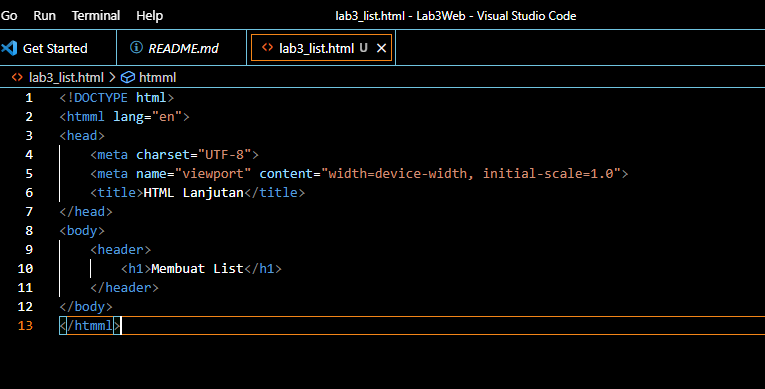
### Membuat Ordered List
Kemudian tambahkan kode untuk membuat Ordered List seperti berikut.
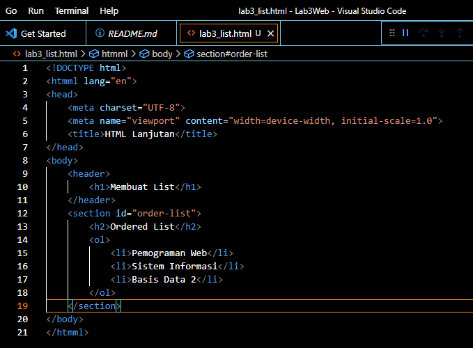
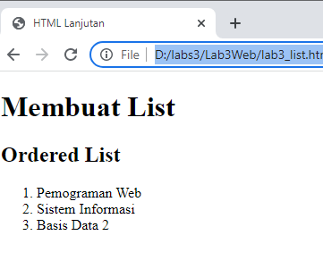

### Membuat Unordered List
Kemudian tambakan kode untuk membuat Unordered List, setelah deklarasi ordered list pada
section <b>unordered-list</b>, seperti berikut.
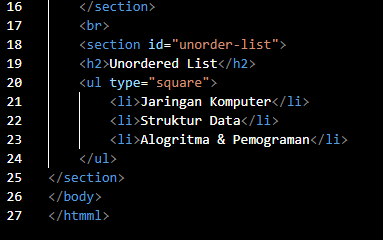
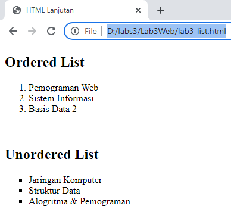

### Membuat Description List
Kemudian tambahkan kode untuk membuat description list setelah deklarasi unorderd-list.
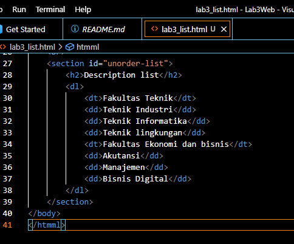
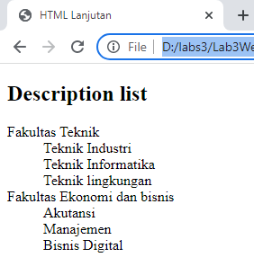
Selanjutnya lakukan eksperimen lain terkait list dan penggunaan atribut type pada list.

## Membuat Tabel
Buat tabel baru dengan nama <b>lab3_tabel.html</b> seperti berikut
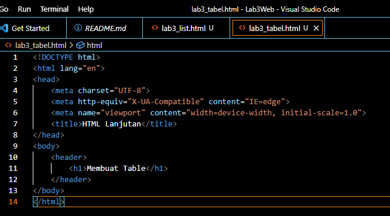
Kemudian selanjutnya tambahkan kode untuk membuat tabel sederhana seperti berikut:
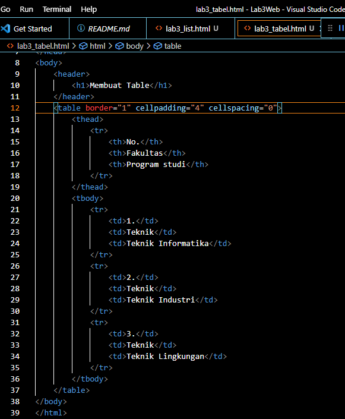
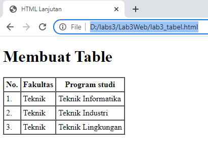

### Menggabungkan Sel Data
Untuk menggabungkan sel data, gunakan atribut rowspan dan colspan. Atribut rowspan untuk
menggabungkan baris (secara vertikal) dan colspan untuk menggabungkan kolom (secara
horizontal).
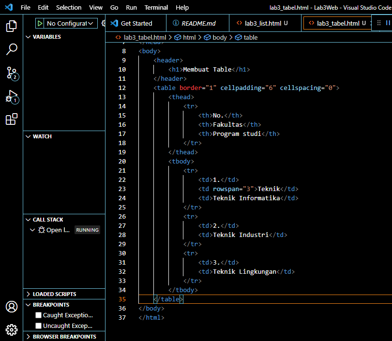
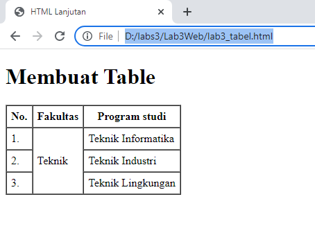

## Membuat Form
Buat file baru dengan nama lab3_form.html seperti berikut.
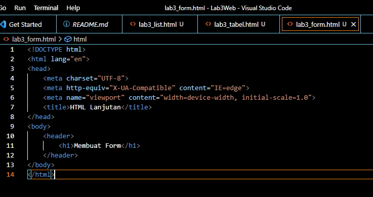
Kemudian selanjutnya tambahkan kode untuk membuat tabel sederhana seperti berikut:
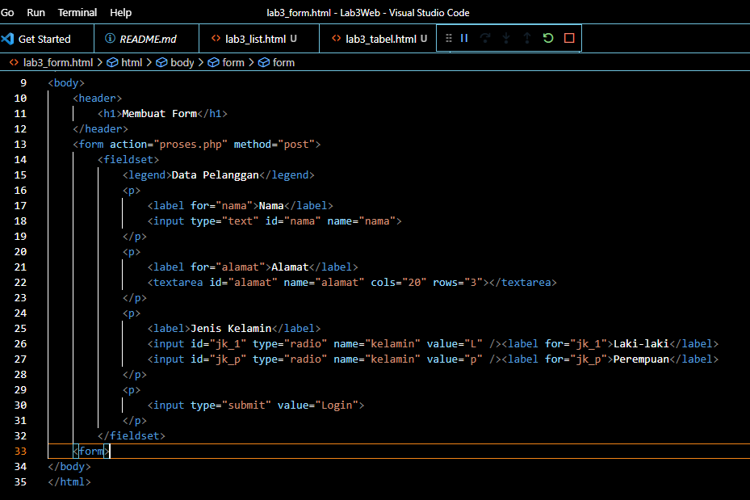
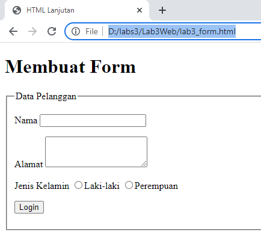

### Menambahkan Style pada Form
Agar tampilan form lebih menarik, bisa ditambahkan CSS seperti berikut.
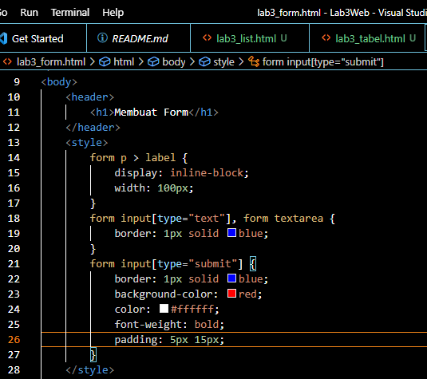
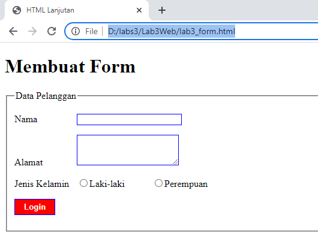

## Pertanyaan dan Tugas
Buatlah form yang menampilkan <b><i>dropdown</b></i> menu dan <b><i>Listbox</b></i> dengan <i>multiple selection</i>.
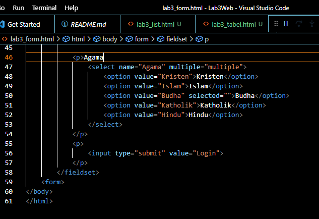
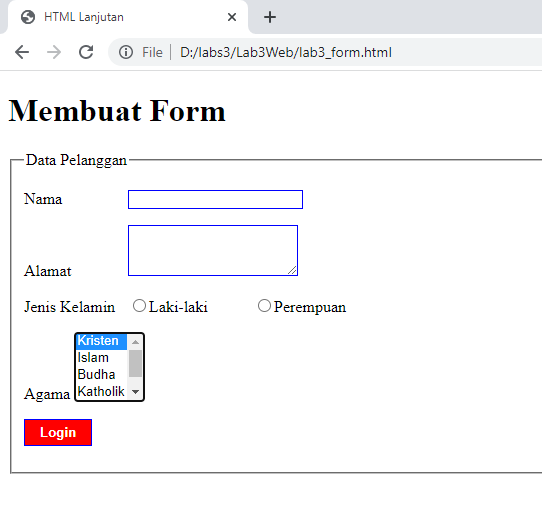
Demikian tugas Lab3Web dari saya. jika ada kesalahan mohon dimaafkan.